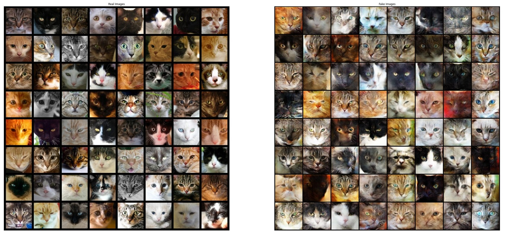
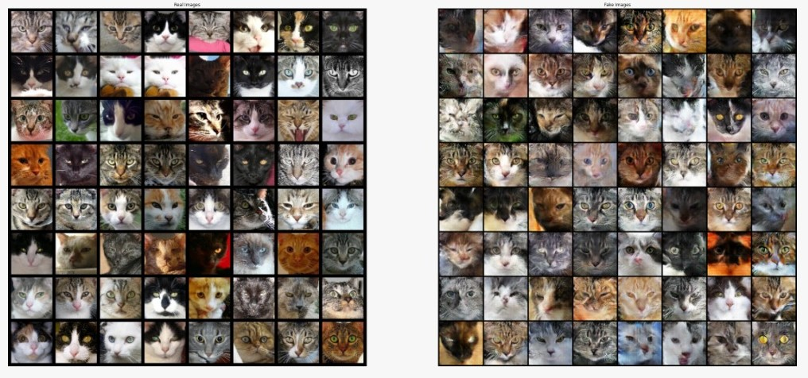
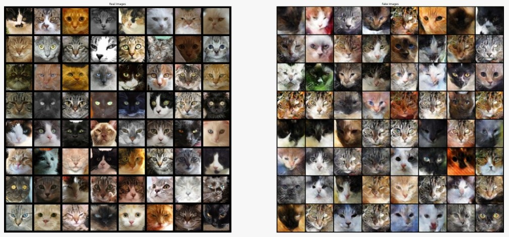

# GAN for cat image generation

## Task

Using PyTorch framework create GAN for generating images with cats. For quality validation we use FID score.

## Example

On the left side - true images, on the right side - generated images

